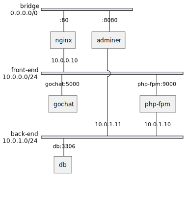

# ドキッ! 脆弱性だらけの Web アプリ

## ネットワーク図



## hosts の編集

- mac: `/private/etc/hosts`
- windows: `C:\Windows\System32\drivers\etc\hosts`

```
127.0.0.1 gochat.example.com
127.0.0.1 trap.gochat.example.com
```

## gochat

チャットアプリと罠サイト

- XSS
- `http://localhost/gochat.php?name=%3Cscript%3Ealert(document.cookie)%3C/script%3E`

## e-library

電子書籍の貸出管理

- SQLi

## testing

- PlayWright  
  脆弱性診断
