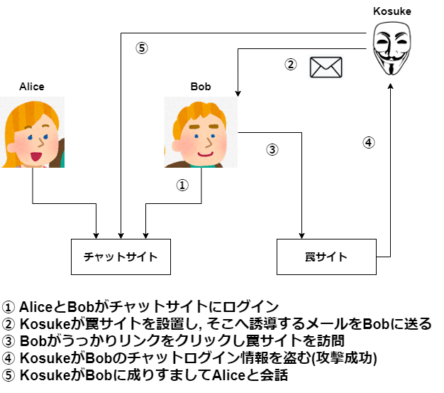
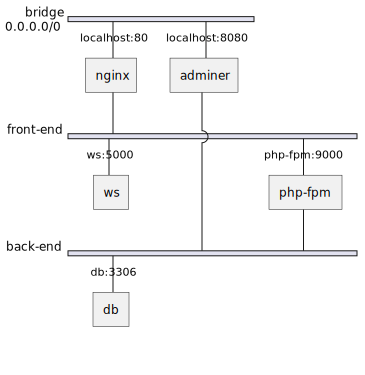

# BadChat

## 攻撃のシナリオ



## ネットワーク図



## hosts の編集

- mac: `/private/etc/hosts`
- windows: `C:\Windows\System32\drivers\etc\hosts`

```
127.0.0.1 badchat.example.com
127.0.0.1 badchat.ws.example.com
127.0.0.1 badchat.trap.example.com
```

## Slack API の設定

`.env`

```
SLACK_CHANNEL_ID="XXXXX"
SLACK_APP_TOKEN="YYYYY"
```

## テスト用

- `http://badchat.example.com?name=%3Cscript%3Ealert(document.cookie)%3C/script%3E`
